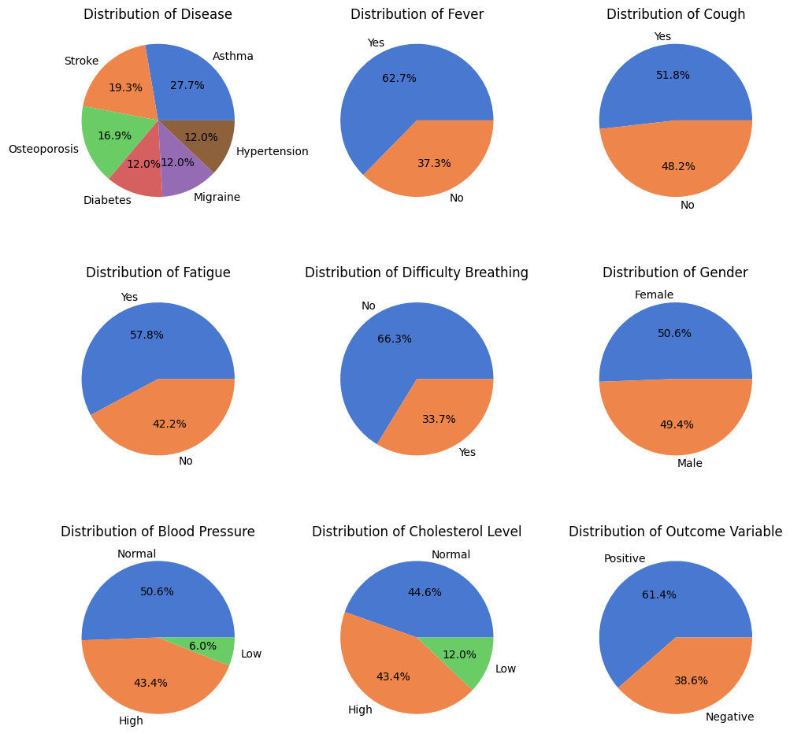
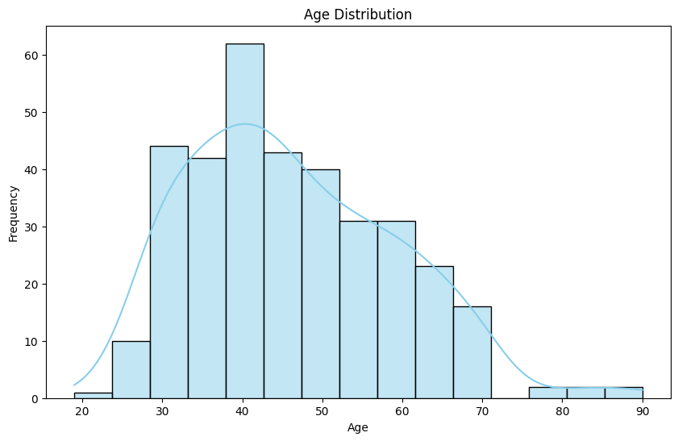
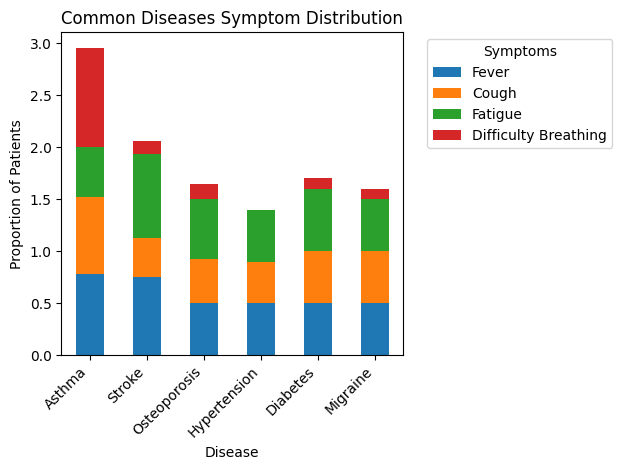
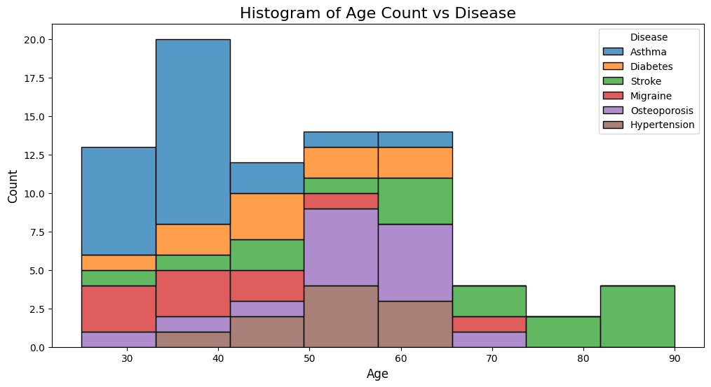
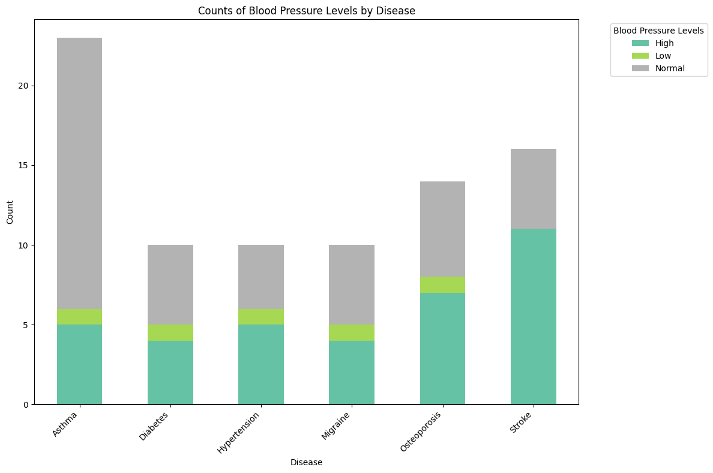
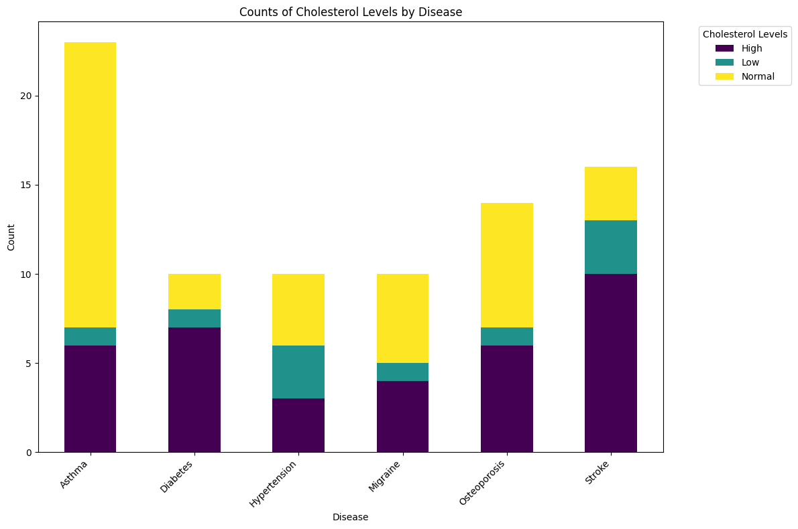
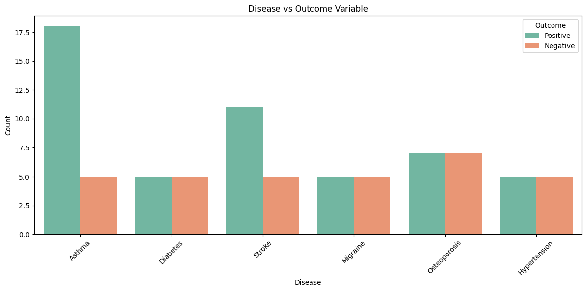

# Symptom analysis for common diseases using EDA

## Objective: 

This dataset from Kaggle is a collection of patient records that contain various symptoms and health indicators for a range of diseases. The aim of this project is to analyze the relationship between most common diseases and patient symptoms, health indicators and characteristics.

## Datasest attributes
* Disease: The name of the disease
* Fever: Whether the patient has a fever (Yes/No)
* Cough: Whether the patient has a cough (Yes/No)
* Fatigue: Whether the patient is experiencing fatigue (Yes/No)
* Difficulty breathing: Whether the patient has difficulty breathing (Yes/No)
* Age: The age of the patient (years)
* Gender: The sex of the patient (Male/Female)
* Blood pressure: Blood pressure of the patient (High/Normal/Low)
* Cholesterol level:Cholesterol level of the patient (High/Normal/Low)
* Outcome variable: Indicates when the diagnosis of the patient having this specific disease is positive or negative (Positive/Negative)
  
## Data Loading and Preprocessing

Data has no missing values and the categorical columns have consistent entries which can be seen when checking for unique values. However there are only 349 entries but 116 different disease types. Therefore the sample size for each disease type is very small. In order to overcome this issue, diseases with counts less than 10 are removed from the analysis. 

The dataset has also been label encoded for easier analysis. 

## Exploratory Data Analysis:

### Feature Analysis:

- Disease
Diseases with counts greater than 10 are Asthma, Hypertension, Diabetes, Migraine, Osteoporosis and Stroke. Asthma appears to be the most common disease representing 27.7% of the total patients in the filtered dataset.

- Fever
62.7% of the patients in this updated dataset have a fever. 

- Cough
51.8% of the patients presented with a cough. 

- Fatigue
57.8% of the patients have fatigue. 

- Difficulty breathing
66.3% of the patients have difficulty breathing.

- Gender
There is an even distribution of males and females.

- Blood pressure
50.6% of the patients have normal blood pressure, 43.3% have high blood pressure and 6% have low blood pressure.

- Cholesterol level
44.6% of the patients have normal cholesterol level, 43.4% have high cholesterol level and 12% have low cholesterol level.

- Outcome variable
61.4% of the patients have positive outcomes and 38.6% have negative outcomes for the disease they were tested for.

- Age

Age distribution of the data seems uniform with a slight skew towards the younger age group. The range of ages in this dataset are between 15-74.

### Symptom Distribution for each disease type:

The most common symptom for Asthma is difficulty breathing. 95% of patients tested for asthma have presented with this symptom. Difficulty breathing is not a common symptom for any other disease type. Fever and Fatigue are the most common presentations for Stroke.

The rest of the symptoms are equally common for all disease types. Further analysis is required to determine which symptoms are most important for each disease type.

### Age distribution for each disease type:

- Asthma is the most common disease for patients under the age of 40.
- For patients 80 and older, the most common disease is a Stroke.
- Osteoporosis and hypertentsion are more common as age increases.
- Diabetes is present in all ages under 70.
- Migraine is appears to be more common in younger patients (under 50).

From this analysis, it is possible to conclude that age is a very important factor for predicting diseases. However, this dataset is limited in size espeically for ages over 80.

### Blood pressure levels for each disease type:

There is a some difference in blood pressure levels for patients with different diseases. Low blood pressure is not a significant factor for any of the diseases. 
- Majorty of the patient tested for asthma have normal blood pressure. This is could be due to the fact that asthma predominantly affects younger patients as shown in the age distribution analysis. 
- High blood pressure is more common in patients tested for stroke. 
- Interestingly, there are equal amounts of patients with high and normal blood pressure that were tested for hypertension. Hypertension is a disease where the primary indication is high blood pressure. 
- For the rest of the diseases, there amount of patients with high and normal blood pressure is equal. The sample sizes for the diseases are very small, so it is difficult to draw accurate conclusions from the data.

### Cholesterol levels for each disease type:

- Majority of the patients tested for asthma have normal cholesterol levels. This is due to the fact that asthma predominantly affects younger patients as shown in the age distribution analysis. A smaller number of patients tested for asthma have high cholesterol levels and low cholesterol is the least common.
- Most of the patients tested for Diabtes and Stroke have high cholesterol levels rather than normal or low cholesterol levels.
- Patients tested for Hypertension have an even distribution across all cholesterol levels. 
- For Migraine and Osteoporosis, patients that were tested mostly have normal or high blood pressure. 

Across most diseases, low cholesterol levels are the least frequent. Based on the data, it is possible to conclude that cholesterol levels are a significant factor for predicting diseases.

### Disease vs Outcome Variable

Asthma and Stroke have a higher proportion of positive diagnoses compared to Diabeters, Hypertension, Migraine and Osteoporosis which have a more balanced distribution. 
This analysis is useful in training and evaluating the performance of a machine learning model. This data can be used to learn the relationship between all the other features and disease diagnosis. During training, the model compares its predictions to the actual outcome variable to adjust and improve.
